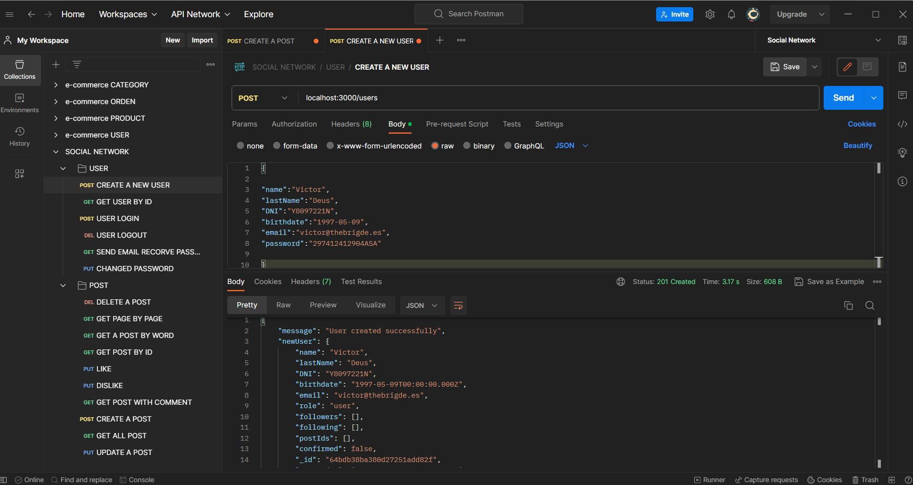
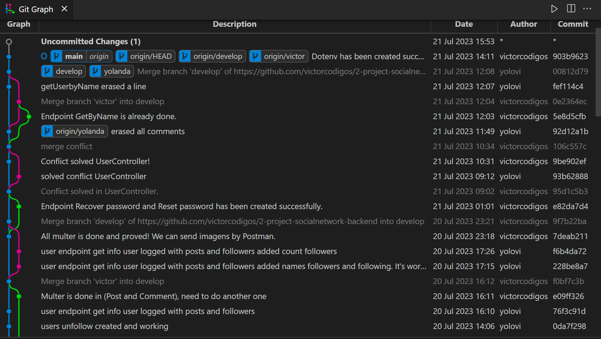

<h2 align="center"> BACKEND PROJECT  </h2> 
<h4 align="center"> SOCIAL NETWORK </h4>
<h4 align="center">with Node, MongoDB & JS express.</h4>

 <p align="center">
    Social network using MongoDB to keep all information.
    <br />
    <a href="https://github.com/victorcodigos/2-project-socialnetwork-backend"><strong>Explore the docs »</strong></a>
    <br />
    ·
    <a href="https://github.com/victorcodigos/2-project-socialnetwork-backend/issues">Report Bug</a>
    ·
    <a href="https://github.com/victorcodigos/2-project-socialnetwork-backend/issues">Request Feature</a>
  </p>
</div>

## <h1 align="center"> 🧑‍💻 Description | Development 👩‍💻 </h1>

Project backend developed in JavaScript, using Express, Mongosh and Mongoose for solid integration with a MongoDB database. Bcrypt and JSON Web Token to ensure the security of user data. Also, use Nodemailer to confirm emails and recover password. We also use the Multer to be able to send a photo from the body.


## *Endpoints* 

CRUD (Create, Read, Update, Delete).

We have created a social network with different types of Endpoints, some of which are very specific and secure. We implemented the isAuthor middleware, which makes the social network more secure. All endpoints were tested in Postman before we shipped to the Main branch.

**Posts** 🌃
--
**Users** 👥
--
**Likes** 👍
--
**Comments** 🧑‍💻
--

<h1>
   </img>
  
  </h1> 


## Extras ✨

- Usage of the `multer` middleware to attach images when creating or updating posts, comments, and users.

- Users cannot follow themselves, and they can unfollow without already following.

- Comments CRUD (Create, Read, Update, Delete).

- Validation in the login process: users must have confirmed their email to log in.

- Creation of documentation for the project's endpoints.

- Implementation of confirmation email for recover password.

- The endpoint that fetches all posts also includes information about the users who created the post and the comments, including the users who made the comments.

- The endpoint that fetches information about the user also returns their posts and number of followers.


### Challenge 🎢 & Skills Achieved

- User registration using Bcrypt.
- User login + token + middleware.
- Implementing CRUD operations.
- Validations.
- Using Multer to send images.
- Using nodemailer to send confimation email and recover password.


### Technologies used :


# Documentation 📂 :

[Postman documentation - SOCIAL NETWORK ](https://documenter.getpostman.com/view/28231675/2s946k7WWG) 


## Deployment THIS PROJECT 🚀 :


To deploy the project:

```bash

  npm run deploy


```
## Dependencies:

```bash

 "dependencies": {
    "bcryptjs": "^2.4.3",
    "dotenv": "^16.3.1",
    "express": "^4.18.2",
    "jsonwebtoken": "^9.0.1",
    "mongodb": "^5.7.0",
    "mongoose": "^7.3.4",
    "multer": "^1.4.5-lts.1",
    "nodemailer": "^6.9.3",
    "swagger-ui-express": "^5.0.0"
  },

  ```

## Working with branches 🎯

This project was very good because we learned how to work with branches and handle GitHub commands, we learned how to handle the few conflicts we had and at the end of the project it was gratifying to see everything working as we imagined. 

<h1>
   </img>
  
  </h1> 

  ## Future Roadmap

- [ ] Add a different style
- [ ] Add more products
- [ ] Add reviews
- [ ] Swagger with images


## Contributing

Contributions are what make the open source community such an amazing place to learn, inspire, and create. Any contributions you make are **greatly appreciated**.

If you have a suggestion that would make this better, please fork the repo and create a pull request. You can also simply open an issue with the tag "enhancement".
Don't forget to give the project a star! Thanks again!

1. Fork the project
2. Create your feature Branch (`git checkout -b feature/YourName`)
3. Commit your changes (`git commit -m 'Add some YourName`)
4. Push to the branch (`git push origin feature/YourName`)
5. Open a pull request.

# Project made by Victor and Yolanda.

### 📫 How to reach us:

<a href="https://www.linkedin.com/in/victor-macedo-4a8901210/" target="_blank"> Victor Macedo </a>

<a href="https://www.linkedin.com/in/yolanda-lv/" target="_blank"> Yolanda López </a> 